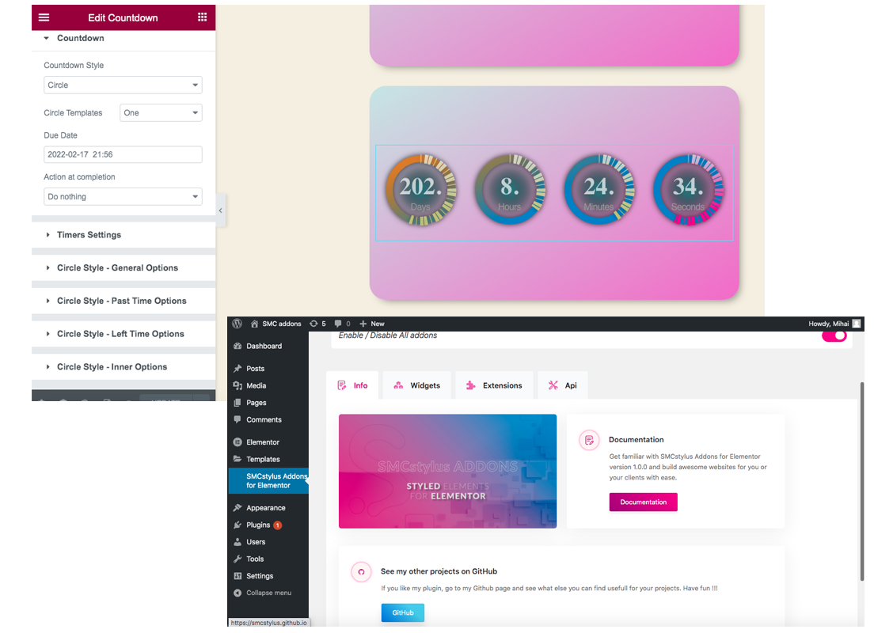
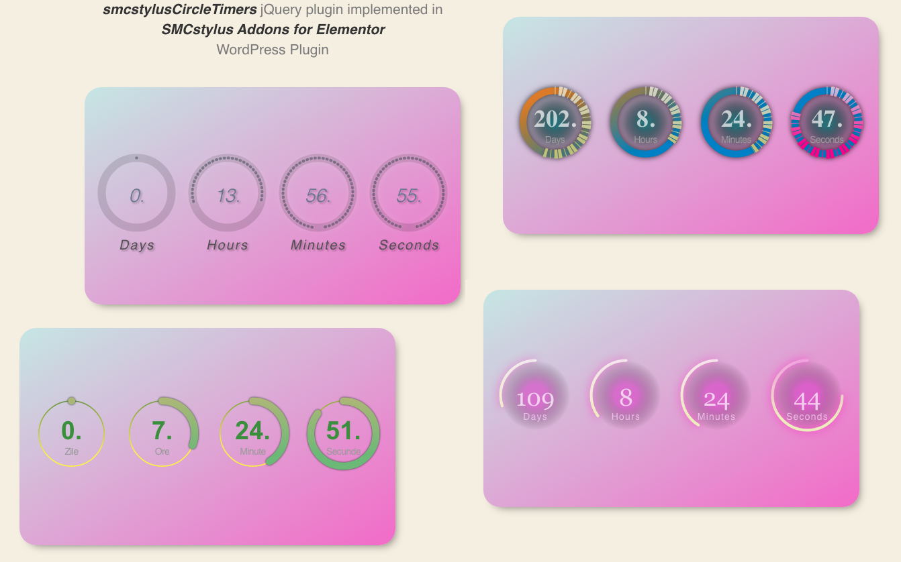

<b>Note before start: selecting the branch you select the version, "main" being the first relase.</b>   
I'm not a fan of page builders for WP, but I needed to use Elementor. Before I used Divi and WP Backery. So in order to understand more about Elementor, how the addons are working, I started bulding this plugin.  
For the moment, <b>SMCstylus Addons for Elementor</b> have 2 extensions and just 1 cool addon.
<ul>
  <li>extensions:
    <ul>
      <li>CSS box for the free version of Elementor</li>
      <li>JS box</li>
    </ul>
  </li>
  
  <li>widgets:
    <ul>
      <li>Countdown - flat, circle, flipper style</li>
    </ul>
  </li>
  </ul>
With the use of <b>Countdown widget</b> you can create beautiful circle countdowns. Can be styled in many ways using the advanced jQuery plugin <a href="https://github.com/smcstylus/smcstylusCircleTimers" target="_blank" title="smcstylusCircleTimers">smcstylusCircleTimers</a>
 
 
Version 1.0.0: 
- Extensions: CSS box for the free version of Elementor, JS box 
- Widgets: Countdown - circle and flat style 
Version 1.1.0 
- Widgets: Countdown - added flipper style 
 
 
Plugin:

 
Result:

